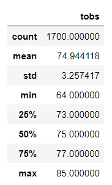
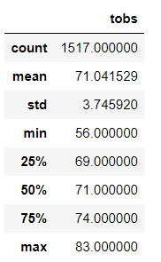

# Surfs_Up
##Overview of the statistical analysis:
In order to go through the plans of opening a surf shop in Oahu, W. Avy wants to analyze temperature data for the months of June and December to determine whether the new business is sustainable year around. 

##Results:

There is a bulleted list that addresses the three key differences in weather between June and December. (6 pt)
##Summary:

There is a high-level summary of the results and there are two additional queries to perform to gather more weather data for June and December. (5 pt)
